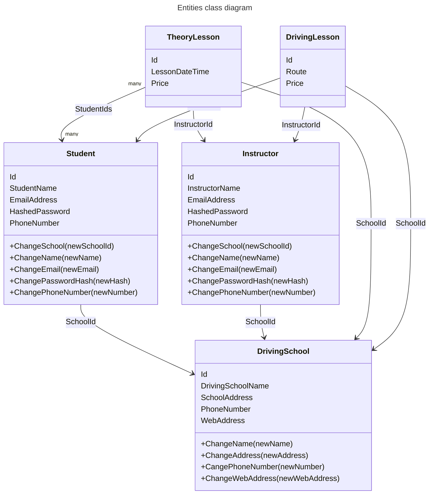

# Driving School API
## Project structure


This project follows a clean architecture structure.

The following layers in the project are:
- [Domain](DrivingSchoolApi.Domain)
  - Contains entities and value objects
  - Classes here are stored in the database
- [Application](DrivingSchoolApi.Application)
  - Contains use-cases
  - Defines interfaces for repositories
- [Infrastructure](DrivingSchoolApi.Infrastructure)
  - Contains external services, in our case PostgreSql
  - Implements interfaces from the application layer
- [Presentation](DrivingSchoolApi)
  - Contains the API endpoints and DTOs

In principle, the presentation layer should not depend on the infrastructure
layer in any regard, but in our case it was necessary in order to set up
the dependency injection for the API controllers.

Because of this, we should keep all classes, either internal or private in the infrastructure layer
except for the [DependencyInjection](DrivingSchoolApi.Infrastructure/DependencyInjection.cs) class which only contains a single extension method


### Domain layer
#### Folder structure
```md
.
├── Entities        # Objects with their identity defined by a single id
├── Exceptions      # Domain Exceptions
├── Keys            # IDs for Entities
├── Primitives      # Abstract classes
└── ValueObjects    # Immutable objects with their identity only defined by their fields
```

### Entities



## Setup
### Docker compose
In order to make project work properly, you need to create a file named ".env" on the root directory of the project

In this file you need to define the following:
- DB_USER
  - The username for the postgres database
  - e.g. DB_USER=dev
- DB_PASSWD
  - The password for the postgres database
  - e.g. DB_PASSWD=dev
- DB_PORT_HOST
  - The port number on your host machine where you want to receive traffic for the database
  - e.g. DB_PORT_HOST=5430
- DB_PORT_CONTAINER
  - The port number within the container that's listening for connections for the database
  - e.g. DB_PORT_CONTAINER=5430
- API_PORT_HOST
    - The port number on your host machine where you want to receive traffic for the API
    - e.g. API_PORT_HOST=5259
- API_PORT_CONTAINER 
  - The port number within the container that's listening for connections for the API
  - e.g. API_PORT_HOST=5259
- JWT_ACCESS_SIGNING_KEY
  - The base64 signing key for access tokens
  - e.g. JWT_ACCESS_SIGNING_KEY={some random and secure base64 string}
- JWT_REFRESH_SIGNING_KEY
  - The base64 signing key for refresh tokens
  - e.g. JWT_REFRESH_SIGNING_KEY={some random and secure base64 string}

#### Example
Using the examples above, the .env file would look something like this
```dotenv
DB_USER=dev
DB_PASSWD=dev
DB_PORT_HOST=5430
DB_PORT_CONTAINER=5430

API_PORT_HOST=5259
API_PORT_CONTAINER=5259

JWT_ACCESS_SIGNING_KEY=ZbE2F1j9kCpp/m7oK/4k26zjSyI14NfLkuF3QBsFk5xvx0M7J3jdpRpRI5AEecCVrpWC8e6/fRzYRRY0jleXJocz2LqniXdfc5QykK8UAoXFhIAaS04xKsApV+N8CJF3gWfl5U9t7+ozarhg+P8pvy2qbRr3Zs7/gh+02ZbAwR2Yyh/D4acNwMipusg6WCeRMKAlKe2cwq7EVymXDWz4h5jxHp4u2D/82lfaJNTiP7tmm8HlEHk2yxy0+m17wRhXRoATNUTJqioKEOvDQYTiWTdeCMd69KHclccWqq3B5eUsonE8/1YYQcQZfrz9D1g4CNMRnIxZi2cJxMPP7pfyAA==
JWT_REFRESH_SIGNING_KEY=+t96aFoRNeWOCcbn035jDflLSbWVfVn06xXPpbApJtN2ZqTPdkbTiDu57PQ3GFcrQbfj2oQ5jteGYIGVpa/0xmeumDvrzM1qvyt1P0j2NU69jg1WGR6gb0p5RARSsJVTg17QJ61Z9bIzA43CbA9gXyHbk0kYEYBJimAlFt1gaKBEhD+9RTUDPDoIgTDUGRpiv0OzY+ISyB4spIVMGGMyvU5kOJTVGXbf/PaOod0lNBHKzxFLNR8FIfnz9Xon7H4Gpdvuq5hdAMbdH748uJNLKKoCU40+BbOyfTuLyUDJ3g/uKFcPCj9ZhvRtqiRnHmdhJa0KwTwZA7oG8wO7UXmelQ==

BUILD_ENVIRONMENT=Development
```
